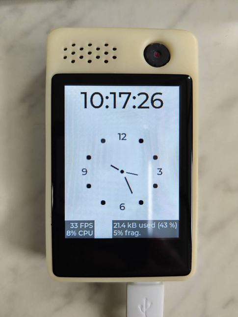
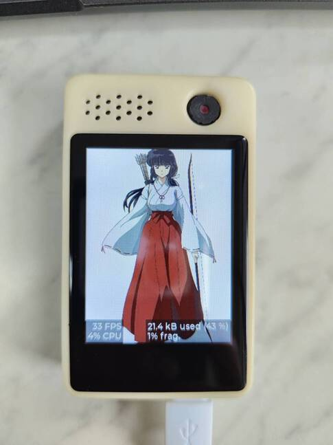
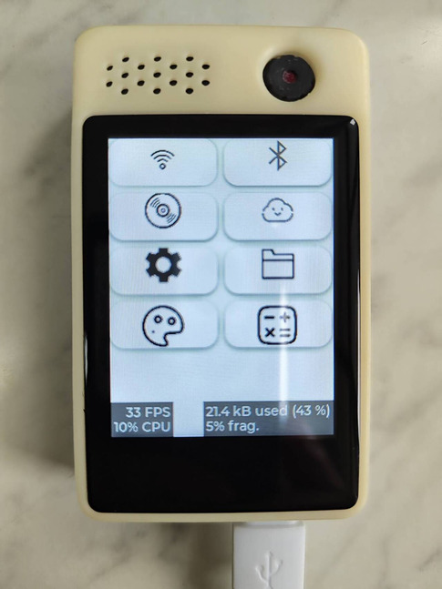
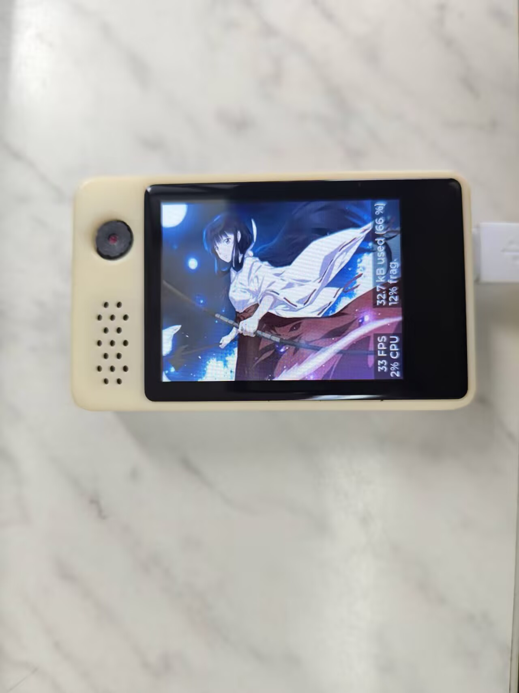

[中文版本](/README_CN.md)

[](LICENSE)
[](https://github.com/espressif/esp-idf)

## Overview

This project is an open-source smart watch developed using the ESP32-S3 microcontroller. It utilizes the ESP-IDF framework (release/v5.4.2) and is based on the LCSC-boards LCKFB-SZPI-ESP32-S3-VA development board (available from [LCSC](https://www.lcsc.com/) or [SZLCSC](https://www.szlcsc.com/)). The graphical user interface (GUI) is implemented with LVGL for smooth rendering and interaction.

The architecture emphasizes modularity and scalability:
- Employs the ESP event loop with a publisher/subscriber model for decoupling components. Publishers don't need to know about subscribers, and vice versa.
- Uses a single LVGL task to ensure thread-safety of LVGL APIs, handling UI requests via a message queue.

## Features

- **WiFi Management**: Supports enabling/disabling, scanning, and connecting to networks. Upon obtaining an IP address, it automatically sends an SNTP request to sync time to the local RTC. It also fetches weather data via HTTPS (China region only) and updates the UI accordingly.
- **BLE HID Device**: Implements standard HID protocol over BLE GATT. Displays pairing PIN on screen; after encrypted connection, controls volume up/down, song next/previous, play/pause.
- **SD Card File Browser**: Reads and displays SD card contents using LVGL widget lists. Supports directory navigation and BMP image viewing.
- **Camera Integration**: Drives GC0308 camera for real-time preview on SPI LCD. Captures photos (press BOOT0 button) and saves as BMP to SD card.
- **Simple Calculator**: Uses dual stacks (one for operators, one for operands) to handle basic arithmetic (+, -, *, /) with parentheses, supporting nested expressions like "(1*((6+2)/4)-6)".
- **Settings Interface**: Configures system options, such as weather API location, screen brightness adjustment, internal RAM and PSRAM usage monitoring (if enabled), and SD card info (mount status and capacity).
- **Calendar and Canvas**: Basic calendar view and simple drawing canvas.
- **Deep Sleep Mode**: Retains only RTC power domain; RTC clock continues running. Upon wake-up, UI time resumes without resyncing via SNTP.

## Limitations

- **SD Card Browsing**: If a directory has too many files, not all will be listed due to LVGL widget memory allocation limits in internal SRAM, which may cause crashes. The file browser only supports displaying BMP format images with 16/24/32-bit color depth. Decoded images are stored in PSRAM and freed after display, so no need to worry about RAM usage.
- **Resource Constraints**: Due to ESP32-S3 internal RAM limitations, WiFi, BLE, and camera cannot be used simultaneously. The code enforces this restriction.
- LVGL uses version 8.3.11. If upgrading to LVGL v9, resolve version incompatibility issues yourself.
- Dependencies are declared in `/main/idf_component.yml` and will be automatically downloaded from [https://components.espressif.com](https://components.espressif.com) during IDF commands. Modifying this may cause incompatibility issues; proceed with caution.
- **Other Notes**: (Add additional points here if needed.)

## Demo Images

  
  
  


## FAQ

1. **Can I use other ESP-IDF versions?**  
   Not recommended. Manual dependency resolution is required for different versions, and older ones have bugs. For example, IDF v5.2 has I2C interrupt issues leading to watchdog timeouts. Refer to the official documentation for version switching.

2. **The environment setup is too complicated. Can I just flash the program to my LCSC-boards LCKFB-SZPI-ESP32-S3-VA board to test it?**  
   Yes! Open the `/bin/flash_project_args` text file, which defines the download parameters, and enter them sequentially into the official flash download tool.  
   [https://docs.espressif.com/projects/esp-test-tools/zh_CN/latest/esp32s3/production_stage/tools/flash_download_tool.html](https://docs.espressif.com/projects/esp-test-tools/zh_CN/latest/esp32s3/production_stage/tools/flash_download_tool.html)

## Resources

- **BLE HID Device Issue**: When using NimBLE stack, deinitializing BLE after init may cause crashes. Reference:  
  [https://github.com/espressif/esp-idf/issues/17493#issue-3353465850](https://github.com/espressif/esp-idf/issues/17493#issue-3353465850)
- **BLE HID References**:  
  [HID Usage Tables](https://usb.org/document-library/hid-usage-tables-16)  
  [Bluetooth Core Specification 5.0](https://www.bluetooth.com/specifications/specs/core-specification-5-0/)  
  [USB HID Device Class Definition](https://www.usb.org/document-library/device-class-definition-hid-111)
- **ESP-IDF Official Documentation**:  
  [ESP-IDF for ESP32-S3 (v5.4)](https://docs.espressif.com/projects/esp-idf/zh_CN/release-v5.4/esp32s3/index.html)  
  [Espressif Components Registry](https://components.espressif.com/)
- **Seniverse Weather API**:  
  [https://seniverse.yuque.com/hyper_data/api_v3](https://seniverse.yuque.com/hyper_data/api_v3)

## Installation

Please ensure you have installed the specified ESP-IDF version and accompanying tools. If not, refer to the official tutorial.

1. Clone the repository:  
   ```
   git clone https://github.com/survivorhao/esp32s3watch.git
   cd esp32s3watch
   ```

2. Configure:  
   ```
   idf.py menuconfig
   ```

3. Build and flash:  
   ```
   idf.py build
   idf.py -p /dev/ttyUSB0 flash monitor  # Replace with your port
   ```

## Contributing

Contributions are welcome! Fork the repo, create a branch, and submit a pull request.

## License

MIT License - see [LICENSE](LICENSE) for details.
